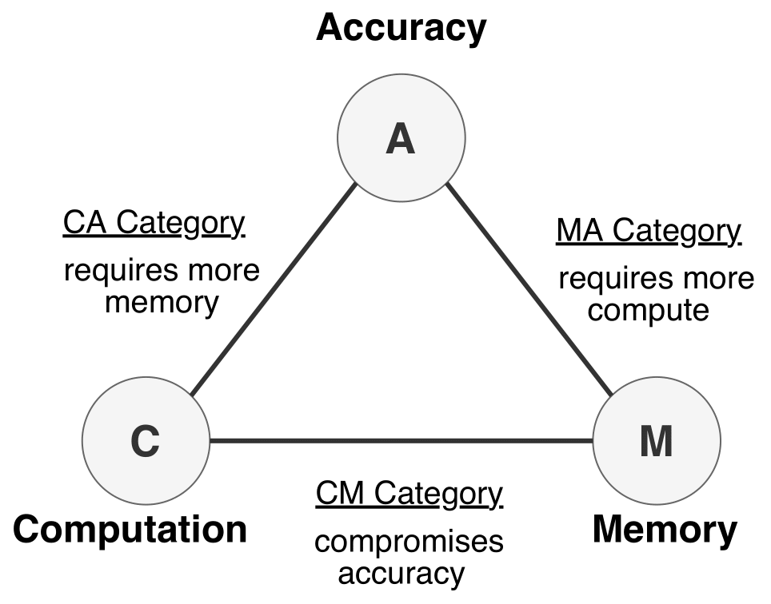

# Training Deep Learning Models on The Edge

Training on the Edge enables continuous learning from new data for deployed neural networks on memory-constrained edge devices. 
Previous work is mostly concerned with reducing the number of model parameters which is only beneficial for inference. 
However, memory footprint from activations is the main bottleneck for training on the edge. 
Existing incremental training methods fine-tune the last few layers sacrificing accuracy gains from re-training the whole model. 

In this work, we investigate the memory footprint of training deep learning models. Using our observations, we exploit activation sparsity and propose a novel bitmap compression format to save the activations during the forward pass of the training, and restoring them during the backward pass for the optimizer computations. The proposed method can be integrated seamlessly in the computation graph of modern deep learning frameworks. Our implementation is safe by construction, and has no negative impact on the accuracy of model training. Experimental results show up to 34% reduction in the memory footprint at a sparsity level of 50%. Further pruning during training results in more than 70% sparsity, which can lead to up to 56% reduction in memory footprint. This work advances the efforts towards bringing more machine learning capabilities to edge devices.

## How this repo is organized

* `cpp`: this folder includes the implementation of the sparse bitmap tensor in C++, and using libtorch.
* `data`: is used to hold experimental data from scripts running from `expr` directory.
* `edgify`: refers to the early implementations of the idea in Python, which did not show the potential of the idea due to the dynamic typing nature of the language. We keep this directory here for future binding with the cpp implementation (contributions are welcome!).
* `expr`: contains recipes used in our experimental results.
* `test`: includes test cases for the continuous integration of the future python package.

## Why isn't this implemented in Python?

High-level languages used in the deep learning frameworks do not provide fine-grained memory management APIs.
For example, Python depends on garbage collection techniques the frees up memory of a given object (i.e. tensor or matrix) when there is no references to it.
This leaves very little control to the developer in controlling how tensors are stored in memory.

Also, all data types in Python are of type `PyObject`, which means that numbers, characters, strings, and bytes are actually Python objects that consumes more memory for object metadata in order to be tracked by the garbage collector.
In other words, defining bits or bytes and expecting to get accurate memory measurements is infeasible.
Therefore, we implemented our proposed bitmap matrix format in C++, using `bitset` and `vector` data types from the C++ standard library for storing the bitmap and the non-zero activations respectively.

## License
BSD-3. See [LICENSE] file.

